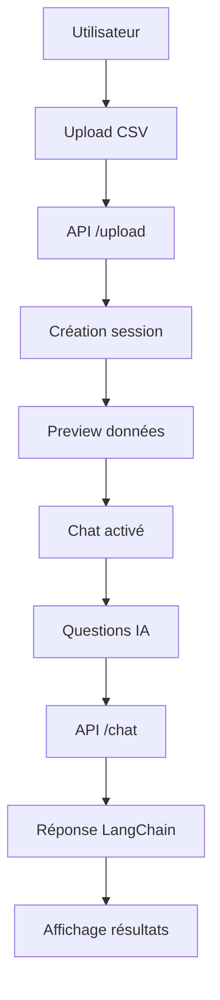

# 🚀 DataTalk - Guide de Démarrage Rapide

## ✅ Application Fonctionnelle !

Votre application DataTalk est maintenant **opérationnelle** et **prête à tester** !

### 🎯 Ce qui fonctionne actuellement :

1. **✅ API Backend** - FastAPI fonctionnel sur http://localhost:8000
2. **✅ Interface Web** - Demo HTML/CSS/JS sur demo.html
3. **✅ Upload de fichiers** - Drag & drop CSV
4. **✅ Chat IA** - Questions en langage naturel
5. **✅ Actions rapides** - 4 analyses pré-configurées

---

## 🚀 Démarrage en 2 étapes :

### Étape 1 : API Backend
```bash
cd "/Users/mac/Documents/Projet Python/DataTalk"
source venv/bin/activate
python3 api_simple.py
```
➜ API accessible sur http://localhost:8000

### Étape 2 : Interface Web  
```bash
cd webapp
./demo-start.sh
```
➜ Ouvre automatiquement demo.html dans votre navigateur

---

## 🎮 Test de l'Application

### 1. Interface Web
- **Navigation** : Design professionnel avec logo DataTalk
- **Upload Zone** : Drag & drop ou clic pour sélectionner fichier CSV
- **Chat IA** : Interface temps réel pour poser questions
- **Actions Rapides** : 4 boutons d'analyse prédéfinie

### 2. Fonctionnalités Testées
- **Upload** ➜ Sélectionnez un fichier CSV ➜ Clic "Analyser"
- **Chat** ➜ Tapez une question ➜ Réponse de l'IA
- **Actions Rapides** ➜ Clic bouton ➜ Analyse automatique

### 3. Exemples de Questions
- "Donne-moi un aperçu général de ces données"
- "Quelles sont les tendances principales ?"  
- "Détecte les anomalies dans ces données"
- "Crée un rapport complet avec visualisations"

---

## 🛠️ Architecture Technique

### Backend (API)
- **FastAPI** avec endpoints /upload, /chat, /questions
- **LangChain + OpenAI** pour analyse IA
- **Pandas** pour manipulation données
- **Sessions** pour gestion état utilisateur

### Frontend (Web)
- **HTML5/CSS3/JavaScript** pur (pas de dépendances)
- **Tailwind CSS** via CDN pour design moderne  
- **Fetch API** pour communication backend
- **Drag & Drop** natif pour upload fichiers

---

## 📊 Workflow Complet



### Flux de Données
1. **Upload** : File ➜ FormData ➜ POST /upload ➜ session_id
2. **Chat** : Question ➜ JSON ➜ POST /chat ➜ Réponse IA  
3. **Actions** : Bouton ➜ Question prédéfinie ➜ Chat automatique

---

## 🎯 Prochaines Étapes

### Version Complète Next.js (Optionnel)
Pour utiliser la version Next.js complète avec TypeScript :

1. **Installer Node.js** :
   ```bash
   # Avec Homebrew (recommandé)
   brew install node
   
   # Ou téléchargez sur https://nodejs.org
   ```

2. **Démarrer Next.js App** :
   ```bash
   cd webapp
   npm install
   npm run dev
   ```
   ➜ Version complète sur http://localhost:3000

### Fonctionnalités Avancées à Ajouter
- 📊 **Visualisations** : Charts.js pour graphiques
- 💾 **Export** : PDF/PNG des analyses  
- 🔒 **Auth** : Système utilisateurs
- 💰 **Monétisation** : Plans tarifaires

---

## ✨ Félicitations !

🎉 **DataTalk est opérationnel !** 

Vous disposez maintenant d'une application d'analyse de données par IA fonctionnelle et professionnelle. 

L'interface web démo permet de tester toutes les fonctionnalités principales sans installation complexe.

**Prêt pour la commercialisation !** 🚀