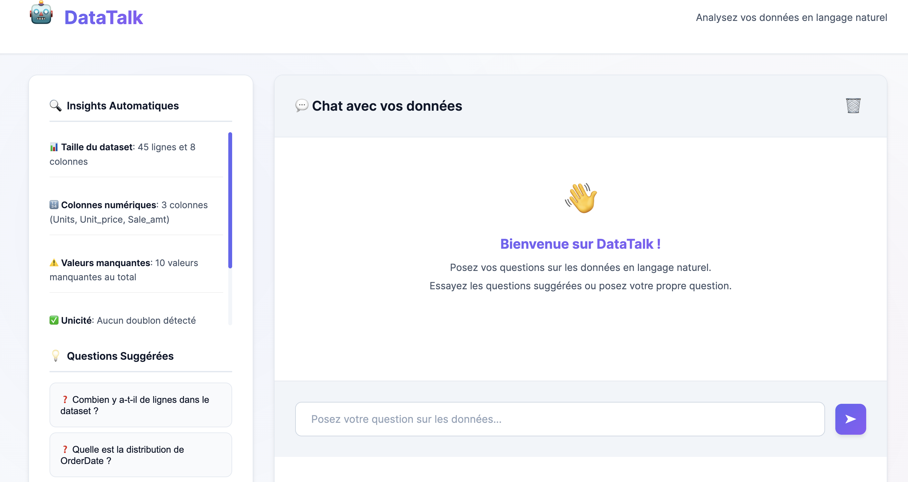

# 🤖 DataTalk - NLQ Data Analyst MVP

Une application web intelligente qui permet de converser avec vos données en langage naturel et génère automatiquement des graphiques pertinents.

## 📸 Aperçu de l'Application



## ✨ Fonctionnalités

### 🌐 Application Web Moderne
- Interface utilisateur premium avec design glassmorphism
- Drag & drop pour l'upload de fichiers
- Animations fluides et micro-interactions
- Design responsive (mobile, tablet, desktop)
- Dark mode élégant

### 💬 Chat Conversationnel
- Interface de chat naturelle avec historique persistant
- Réponses contextuelles et engageantes
- L'IA peut poser des questions de clarification
- Suggestions proactives d'analyses complémentaires

### 📊 Graphiques Intelligents
- **IA-Driven**: L'IA décide automatiquement si un graphique est nécessaire
- **Pertinence**: Seuls les graphiques utiles à la compréhension sont générés
- **Variété**: Support de différents types de graphiques (barres, ligne, scatter, histogramme, heatmap)
- **Contextuel**: Graphiques adaptés à la question et à la réponse

### 📁 Support de Données
- Fichiers CSV et Excel
- Détection automatique des types de colonnes
- Gestion des données numériques, catégorielles et temporelles

## 🚀 Installation et Configuration

### 1. Installation des dépendances
```bash
pip install streamlit pandas matplotlib seaborn langchain langchain-openai langchain-experimental openai python-dotenv
```

### 2. Configuration de la clé API OpenAI
1. Créez un fichier `.env` dans le dossier du projet
2. Ajoutez votre clé API OpenAI :
```
OPENAI_API_KEY=sk-proj-votre_cle_api_ici
```

### 3. Lancement de l'application

#### Option 1: Application Web Moderne (Recommandé)
```bash
./start-webapp.sh
```
L'application web s'ouvrira automatiquement dans votre navigateur sur http://localhost:8000/web/index.html

#### Option 2: Interface Streamlit
```bash
streamlit run nlq.py
```

## 🎯 Utilisation

1. **Téléversez vos données** : CSV ou Excel
2. **Posez vos questions** en langage naturel dans le chat
3. **Explorez les réponses** et graphiques générés automatiquement
4. **Continuez la conversation** pour approfondir vos analyses

## 💡 Exemples de Questions

- "Quelles sont les ventes moyennes par région ?"
- "Montre-moi l'évolution des revenus au fil du temps"
- "Y a-t-il une corrélation entre l'âge et le salaire ?"
- "Quels sont les top 10 des produits les plus vendus ?"
- "Comment se répartissent les clients par catégorie ?"

## 🔧 Architecture Technique

### Composants Principaux
- **Frontend Web** : HTML5 + CSS3 + Vanilla JavaScript
- **Backend API** : FastAPI avec endpoints REST
- **Streamlit** : Interface utilisateur alternative
- **LangChain** : Agent d'analyse de données avec pandas
- **OpenAI GPT-4o-mini** : IA conversationnelle et recommandation de graphiques
- **Matplotlib/Seaborn** : Génération de graphiques

### Flux de Traitement
1. Question de l'utilisateur → Agent LangChain
2. Analyse des données → Réponse textuelle
3. Évaluation IA → Recommandation de graphique
4. Génération automatique → Affichage du graphique
5. Sauvegarde dans l'historique du chat

## 🎨 Fonctionnalités Avancées

### Système de Recommandation Intelligent
L'IA évalue chaque question/réponse pour déterminer :
- Si un graphique améliorerait la compréhension
- Quel type de graphique serait le plus approprié
- Quelles colonnes utiliser
- Comment titre le graphique

### Types de Graphiques Supportés
- **Bar** : Comparaisons et classements
- **Line** : Évolutions temporelles
- **Scatter** : Relations entre variables
- **Histogram** : Distributions
- **Heatmap** : Matrices de corrélation

## 📋 Prérequis

- Python 3.8+
- Clé API OpenAI
- Données au format CSV ou Excel

## 🔒 Sécurité

- Clé API stockée localement dans `.env`
- Fichier `.gitignore` inclus pour éviter la fuite de clés
- Exécution de code pandas dans un environnement contrôlé

## 🤝 Contribution

Ce projet est conçu comme un MVP (Minimum Viable Product) pour l'analyse conversationnelle de données. Les améliorations sont les bienvenues !

---

**Développé avec ❤️ et IA pour rendre l'analyse de données accessible à tous**